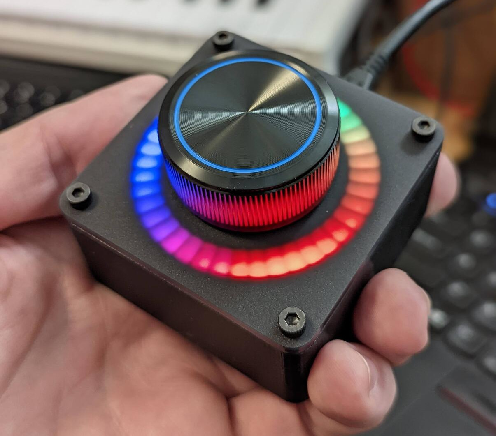

ESPHome Knob
============

A big knob. Y'know, for doing knobby things.

This connects to [Home Assistant](https://www.home-assistant.io/) using
[Esphome](https://esphome.io/). The firmware configuration in
this repository is set up for submitting 0-10 ratings, but it could be easily
adjusted for different behavior.

Ingredients
-----------

### Electronics

 * Wemos d1 mini esp8266-based board (or similar)
 * 6mm dia rotary encoder with detents + button (24 PPR) ([Digikey part 118-PEC11H-4215F-S0024-ND](https://www.digikey.com/en/products/detail/bourns-inc/PEC11H-4215F-S0024/12349527))
 * SparkFun LuMini LED Ring 2" ([Sparkfun part 14966](https://www.sparkfun.com/products/14966))
 * Some ~24awg hookup wire to connect the LEDs and encoder to the board

### Vitamins

 * 1× really nice, 6mm dia shaft knob. I used a Szliyands 38 x 17 mm Aluminum Alloy knob ([Amazon](https://www.amazon.com/gp/product/B09CCL8BMP/))
 * 10-12× M3 heat-set inserts ([McMaster 94459A130](https://www.mcmaster.com/94459A130))
 * 4× M3×6 black oxide socket head screws ([McMaster 91290A111](https://www.mcmaster.com/91290A111))
 * 4× M3×6 button head screws ([McMaster 94500A221](https://www.mcmaster.com/94500A221))
 * 2-4× M3×6 screws of any sort for mounting the LEDs to the top housing

### Housing

 * 3D printed top piece `housing/top.scad`
 * 3D printed bottom piece `housing/bottom.scad` - this is sized for the version of the d1 mini board I got off ebay. May need adjustments for different boards.
 * laser cut top plate `housing/laser_cut_top_plate.scad` cut from 3mm (0.118") thick [LED black acrylic](https://www.tapplastics.com/product/plastics/cut_to_size_plastic/black_led_sheet/668)

Directions
----------

### 3D print the housing

The housing is designed in [OpenSCAD](https://openscad.org/). If you're new
to OpenSCAD, you'll need to download a copy, load up the `.scad` files in it,
render them, then export them to `.stl` files.

Note: this repository uses a git submodule for part of the housing, so you'll
need to make sure you update your submodules:

    git submodule init
    git submodule update

Print out the top and bottom housing pieces. I used black PETG with a 0.2mm
layer height and supports on the bottom part. The top part should be printed
so the large flat part is face down on your bed.

I had some stringing in the baffles for the LEDs, which I got rid of by
blowing hot air through the holes for a couple of seconds with a heat gun set
to high. If you don't clean out stringing, you'll see it when the light shines
through the baffles.

Once printed and cleaned, using a soldering iron set to 250°C (or whatever
is appropriate for the plastic you use), install the heat-set inserts into
the 8 corner holes on the top and bottom, then inside (for holding the LEDs
to the top piece). I ended up only using 2 inserts+screws to mount the LEDs.

### laser cut the top plate

The top plate should be relatively straightforward. If you don't have access to
a laser cutter, you can either try to order one from an online fab shop, or use
another material. The key part is that it needs to be translucent, but sturdy
enough to hold the knob.

Once the plate is cut, screw it to the housing with the black socket cap
screws. So classy.

### Electronics

For this design, we're going to power everything from the D1 mini's micro USB
port. Ideally, it'd be great if you could just plug this knob into any USB port
and have it just work (at least for power). This is super convenient for a
variety of reasons, but it does mean we need to pay attention to some specific
power concerns especially when it comes to the LEDs.

#### LEDs

The wiring for this is pretty straightforward: the LEDs have 4 pins we'll use:

 * G - Ground
 * 5V - the power input, 5V DC
 * DI - Data In
 * CI - Clock In

The LED board's G and 5V pins connect to the G and 5V pins on the D1 mini.
We're using a bit of a hack here to simplify the wiring: the D1 mini exposes
the raw 5V power line from the USB port on the 5V pin, which means we can pass
plenty of current through it (maxing out at about 1000mA is a good upper limit
here). The LEDs are HONGRY for power and will consume well over the allowable
amount for a device powered by a computer's USB port (500mA).

According to [the datasheet](https://cdn.sparkfun.com/assets/d/c/a/4/2/APA_102-2020-256-6.pdf), each LED will draw at most 18mA.

    18mA × 40 LEDs = 720mA

720mA is quite a bit more than the max of 500mA allowed by computer USB ports.
While phone chargers will output up to 2A (2000mA) of power on a USB port, if
you want to power this thing off your computer, you'll need to limit the
maximum power draw to under 500mA. This includes the power to run the ESP8266
too!

Thankfully ESPHome has a feature where you can set a "color correction
factor" for all the LED channels, which essentially just sets the maximum
brightness of each color. If we set the red, green, and blue channels all to
50% that should cut power in half. (In reality, "brightness" as humans see it
doesn't map linearly to power consumption, but "50%" will reduce the power
enough for this application)

If you're using a different board, you'll want to make sure that you connect the
LED's 5V directly to the USB port's power line. I've seen some boards label this
output "RAW". Basically, if the board has any power regulators on it, you'll
want to bypass those as typically they won't be able to supply enough current
for the LEDs.

Solder some hookup wire (about 8-10cm in length) to the 4 pins mentioned above
on the LED board. This should be longer than we need, which will give us some
play within the housing to line everything up the way we want.

The LED ring should connect to the D1 as follows:

 * LED G → d1_mini G
 * LED 5V → d1_mini 5V
 * LED DI → d1_mini D3
 * LED CI → d1_mini D2

(you can confirm this mapping in the yaml file)

#### Rotary encoder

The rotary encoder we're using has 5 pins: 3 for the rotation bit and 2 for the
push button switch.

There are tons of great resources on the Esphome site about [how rotary
encoders work](https://esphome.io/components/sensor/rotary_encoder.html) in
this context, so I won't repeat that here. If we want a perfect
rotary encoder signal, we should add some signal filtering to the encoder as
recommended by the datasheet. This helps keep everything working smoothly,
so we don't have suprious jumps on the output (see also: debouncing). If this
tickles your fancy, look into rotary encoders that come on breakout boards that
have the filter capicators on them, as that will save you a lot of hassle when
wiring up the panel-mount style that we're doing here.

But I'm lazy and leaving out the filter caps is "good enough" for most cases.
We'll also do a couple tricks to simplify the wiring, which I'll explain below.

First, we need to wire up ground. Because we already wired the LEDs to the D1
mini's only ground pin, we'll need another one. Conveniently, the
rotary encoder dosen't draw much current, so we can actually use a GPIO pin
set to 0V as a "ground pin". We'll use D8, as that pin is already pulled low in
hardware (but we'll set it up as an output and set it to 0V as well).

To further simplify wiring, we can share a ground between the button and the
encoder's A/B signals. For that, solder a small scrap of wire between one of
the two button pins and the center pin on the other side of the encoder.

For our signal wires, we'll be using the ESP8266's built-in pull-up resistors,
which again simplifies wiring. Finally, let's wire this up!
Solder 4 pieces of 8-10cm hookup wire as follows:

 * encoder A → D5
 * encoder G → D8
 * encoder B → D6
 * switch → D7 (the other pin of the switch is wired directly to encoder G)

Don't worry about getting A and B mixed up; you can just swap the pins in the
yaml file to flip it around if it rotates the wrong way.

### Flash ESPHome

With the wiring complete, it's time to flash the firmware. I use the [command
line interface for esphome](https://esphome.io/guides/getting_started_command_line.html) by way of pipenv. For this setup, you can follow the steps below:

First, configure your `secrets.yaml` file. There's a template in
`secrets.yaml.example` you can use: just copy that file over to `secrets.yaml`
and fill it in with some passwords for your device and your wifi credentials.

Once you have `pipenv` installed, open a command prompt and go to the
`esphome/` directory. Then run:

    pipenv install

Which will install esphome and any dependencies into a python virtual
environment. Then do:

    pipenv run esphome compile knob.yaml

And with luck, you'll get a compiled firmware! Once that's done, plug in your
d1 mini into your computer and do:

    pipenv run esphome upload knob.yaml

You may want to watch the logs with:

    pipenv run esphome logs knob.yaml

If everything works, the LEDs should light up with a rainbow!

### Putting it all together

Mount the LEDs to the underside of the top plate using either the socket or
button M3×6 screws.

Mount the rotary encoder to the 3mm acrylic. It should _just barely_ have enough
threads to stay, but if you tighten it gently with a tool, it'll stay firm.

Mount the d1 mini in the bottom housing. You may need to clean out bits of
support material to get it to stay put. The lumpy daughter board with the wifi
antenna is mounted upside-down and the USB port should face out the back. The
edge of the board should be flush with the side wall of the bottom housing.

Screw the bottom housing to the top housing using the button M3×6 screws. They
shouldn't stick out beyond the plastic. If they do, you may need to clean out
support material.

Finally, install the knob on top of the rotary encoder and you're done 🎉

